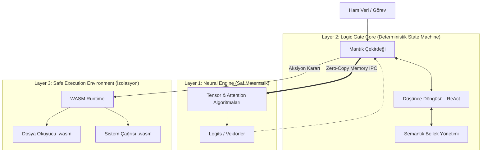

# Mimari Katmanlar (Cognitive OS Architecture)

Sistem, insan bilişinin biyolojik yapısından ilham alan, ancak silikon üzerinde saf donanım ve işletim sistemi prensipleriyle (Sıfır Kopyalama, Bellek Güvenliği, Durum Makineleri) çalışan 3 ayrık katmandan oluşur.

## Katman 1: Neural Engine (Nöral Altyapı - Sistem 1)
- **Tanım:** Sistemin "Sezgisel" (Heuristic) ve olasılıksal tahmin katmanı. İşletim sistemindeki matematik işlemcisi (FPU/GPU) gibi davranır.
- **İçerik:** Öz-Dikkat (Self-Attention) mekanizmaları, Ağırlık (Weight) yönetimi ve İleri Yayılım (Forward Pass) algoritmalarının saf Rust implementasyonu. Dış bağlantı yoktur; model ağırlıkları doğrudan diske/belleğe yüklenir.
- **Çıktı:** Karar değil, salt olasılık dağılımları (logits) ve vektör temsilleri üretir.

## Katman 2: Logic Gate Core (Mantıksal Çekirdek - Sistem 2)
- **Tanım:** Sistemin "Analitik" katmanı. Nöral Motor'dan gelen ham olasılıkları alır, bir mantık süzgecinden geçirir.
- **İçerik:** Düşünce Zinciri (CoT) ve ReAct algoritmaları burada deterministik **Durum Makineleri (State Machines)** olarak kodlanmıştır. Nöral altyapının halüsinasyonlarını matematiksel sınırlar ve kurallarla engeller. 
- **Veri Akışı:** Neural Engine ile aralarındaki iletişim "Zero-Copy" (Sıfır Kopya) bellek paylaşımı ile sağlanır.

## Katman 3: Safe Execution Env. (Güvenli Yürütme Katmanı)
- **Tanım:** Düşüncenin fiziksel aksiyona dönüştüğü, izole edilmiş kum havuzu (Sandbox).
- **İçerik:** Mantık Çekirdeği bir "eylem" kararı aldığında, bu eylem WebAssembly (WASM) tabanlı bir mikro-sanal makinede çalıştırılır. Sistemin ana belleğine izinsiz erişim %100 oranında donanımsal olarak engellenmiştir.

## Mimari Şema

