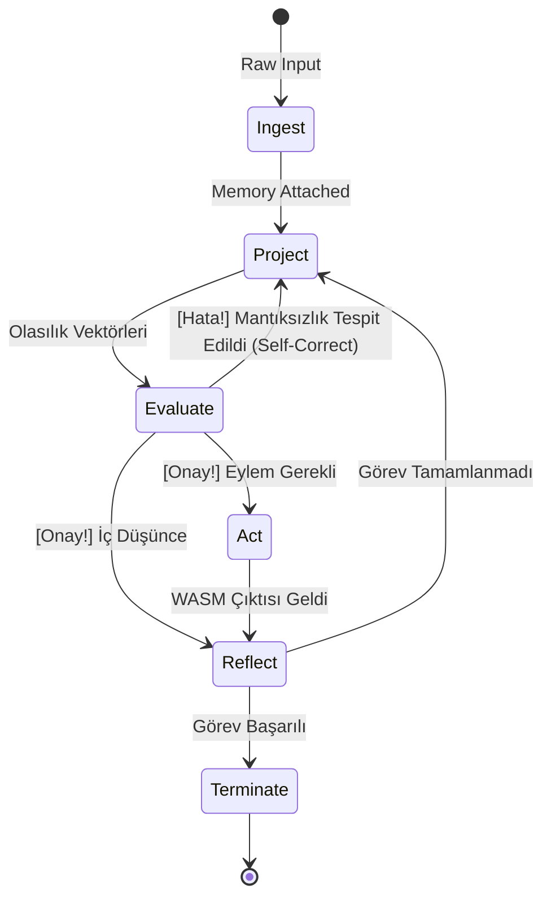

# Bilişsel Döngü Protokolü (Cognitive Loop Protocol)

Bu doküman, sistemin "Düşünce" dediğimiz olguyu, "Olasılıksal Tahminden" çıkarıp "Deterministik bir Aksiyona" dönüştürdüğü **Matematiksel Durum Makinesi (State Machine)** geçişlerini tanımlar.

## Temel Teorem: Düşüncenin Ayrıştırılması
Bir düşünce $T$, Nöral Motorun (Layer 1) ürettiği olasılıksal bir vektör $V$ ile, Mantıksal Çekirdeğin (Layer 2) uyguladığı kural setinin $R$ fonksiyonudur:
`T = f(V, R)`

## Durum Makinesi (State Machine) Döngüsü

Bu döngü `logic-gate-core` tarafından işletilen kesin (strict) kodlanmış aşamalardır:

1. **`Ingest` (Algılama):** 
   - Dış veri sisteme girer. Bellek (Memory) taranır. Bağlam (Context) vektörleştirilir.
2. **`Project` (Nöral Yansıtma - Forward Pass):** 
   - `logic-gate-core`, sorunu çözmek için `neural-engine`'e bir "İleri Yayılım" (Forward Pass) komutu gönderir. *Nöral motor sadece bir sonraki mantıksal olasılıkları üretir.*
3. **`Evaluate` (Mantıksal Sınama):** 
   - Gelen olasılıklar deterministik süzgeçten geçer. Tip güvenliği (Type Safety), döngüsel mantık hatası tespiti ve şema doğrulama (Schema Validation) burada yapılır. Nöral motor saçmalıyorsa, ceza puanı (penalty) uygulanarak adım `Project`'e geri itilir.
4. **`Act` (Eylem):** 
   - Mantıksal sınamadan geçen karar bir "Dış Eylem" gerektiriyorsa, komut `safe-execution-env`'ye (WASM) iletilir. Araç çalıştırılır.
5. **`Reflect` (Öz-Denetim ve Hata Düzeltme):** 
   - Aracın çıktısı tekrar sistemin girdisi olur. Hedef fonksiyonuna $f(x)$ ne kadar yaklaşıldığı hesaplanır. Duruma göre yeni bir `Project` durumu başlatılır veya işlem `Terminate` edilir.

## Protokol Şeması

